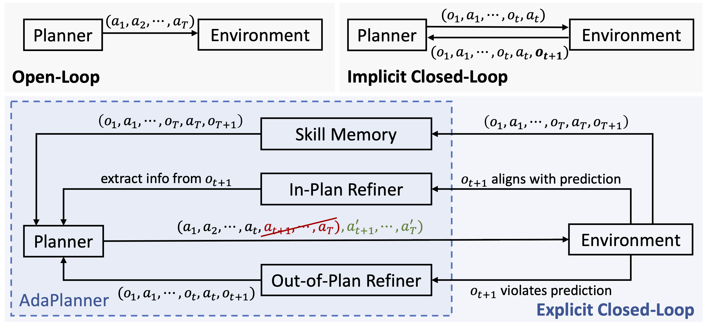
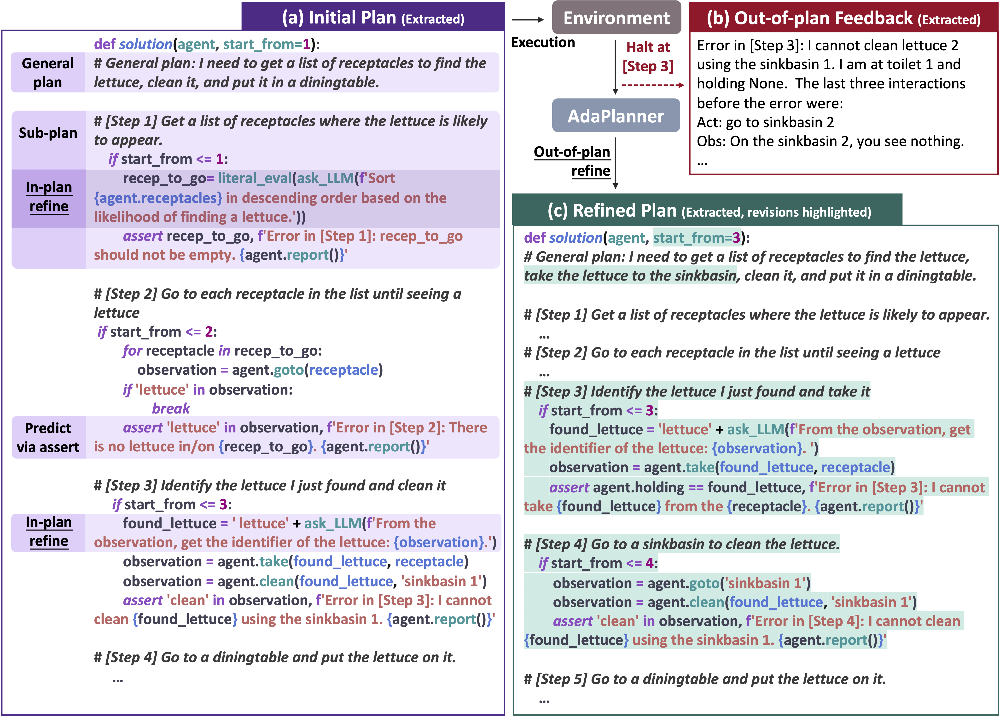

# AdaPlanner
[AdaPlanner: Language Models for Decision Making via Adaptive Planning from Feedback](https://arxiv.org/abs/2305.16653)

## Abstract
Large language models (LLMs) have recently demonstrated the potential in acting as autonomous agents for sequential decision-making tasks. However, most existing methods either take actions greedily without planning or rely on static plans that are not adaptable to environmental feedback. Consequently, the sequential decision-making performance of LLM agents degenerates with problem complexity and plan horizons increase. We propose a closed-loop approach, AdaPlanner, which allows the LLM agent to refine its self-generated plan adaptively in response to environmental feedback. In AdaPlanner, the LLM agent adaptively refines its plan from feedback with both in-plan and out-of-plan refinement strategies. To mitigate hallucination, we develop a code-style LLM prompt structure that facilitates plan generation across a variety of tasks, environments, and agent capabilities. Furthermore, we propose a skill discovery mechanism that leverages successful plans as few-shot exemplars, enabling the agent to plan and refine with fewer task demonstrations. Our experiments in the ALFWorld and MiniWoB++ environments demonstrate that AdaPlanner outperforms state-of-the-art baselines by 3.73% and 4.11% while utilizing 2x and 600x fewer samples, respectively.

## Introduction


AdaPlanner, a closed-loop planning method with LLM playing two roles -- planner and refiner.
The planner decomposes the task into manageable sub-goals and predicts environmental feedback for each.
During execution, the refiner distinguishes and responds to two types of environment feedback -- in-plan feedback is the environmental observation that aligns with the prediction, and out-of-plan feedback is one that deviates from the prediction.
For in-plan feedback, the refiner can dynamically query the LLM to perform reasoning and extract key information from in-plan feedback expressed in natural language.
 This is achieved through a specific action called ask_LLM(), in which the LLM separately parses the observation and obtains information pertinent to subsequent actions.
For out-of-plan feedback, the refiner proactively revises the entire plan and resumes to solve the current task from an intermediate point.
AdaPlanner's adaptive closed-loop framework alleviates the need for prior knowledge about the feedback structure and permits the agent to instantly adopt a refined plan rather than restarting from scratch in a reset episode. This leads to a more efficient and adaptive decision-making process. 



AdaPlanner operates solely via prompting, eliminating the need for a dedicated training phase and reducing its computational cost.
Furthermore, AdaPlanner leverages a code-based prompting for precise planning and refinement. The use of code prompts facilitates task decomposition into sub-goals and mitigates LLM hallucination during the decision-making process.
AdaPlanner also features a skill discovery process, which accumulates successful experiences to guide future planning. This feature further enhances its long-term planning ability and sample efficiency.
## Setups
You need to get an OpenAI API key and store it in the environment variable identified as `OPENAI_API_KEY`. Please also install the `openai` and `gym` package.

### ALFWorld
For ALFWorld, please refer to the instuction [here](https://github.com/alfworld/alfworld) and install all required packages.

### MiniWoB++
For MiniWoB++, please refer to the documentation [here](https://miniwob.farama.org/content/getting_started/) and install the following packages:
- selenium
- Pillow
- regex

To install MiniWoB++, you need to navigate to the computergym directory and execute the following installation command:
```
cd computergym
pip install -e .
```

### Experiments
To run the experiments, please navigate to the corresponding directory and run the Jupyter notebook (`alfworld.ipynb`, `miniwobpp.ipynb`).

### Citation
```
@misc{sun2023adaplanner,
      title={AdaPlanner: Adaptive Planning from Feedback with Language Models}, 
      author={Haotian Sun and Yuchen Zhuang and Lingkai Kong and Bo Dai and Chao Zhang},
      year={2023},
      eprint={2305.16653},
      archivePrefix={arXiv},
      primaryClass={cs.CL}
}
```

